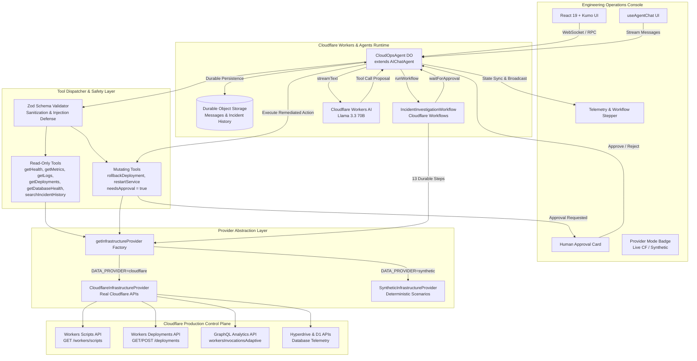

# CloudOps Agent: AI-Powered Infrastructure Operations on Cloudflare

CloudOps Agent is an autonomous, production-quality infrastructure operations assistant built on the **Cloudflare Agents SDK**, **Cloudflare Workflows**, **Cloudflare Workers AI**, and **Cloudflare Durable Objects**.

It enables Site Reliability Engineers (SREs) and software engineers to investigate production outages through natural language chat, automatically correlates multi-signal telemetry (health checks, GraphQL time-series metrics, invocation error logs, deployment history, and database connection pools), executes durable multi-step investigations via Cloudflare Workflows, and safeguards production environments with mandatory **human-in-the-loop approval** for mutating remediation actions (such as Cloudflare Worker version rollbacks).

CloudOps Agent features a **dual-provider architecture**:

1. **Live Cloudflare Infrastructure Mode (`CloudflareInfrastructureProvider`)**: Operates on real Cloudflare infrastructure using official Cloudflare REST and GraphQL Analytics APIs (Workers Scripts, Deployments, GraphQL `workersInvocationsAdaptive`, Hyperdrive, and D1).
2. **Synthetic Simulation Mode (`SyntheticInfrastructureProvider`)**: Provides deterministic incident scenarios (`payment-api`, `auth-service`, `orders-api`) for automated CI testing and offline evaluation.

---

## Table of Contents

1. [Problem Statement](#1-problem-statement)
2. [Dual-Provider Architecture](#2-dual-provider-architecture)
3. [Mermaid Architecture Diagram](#3-mermaid-architecture-diagram)
4. [Real Cloudflare Infrastructure Integration](#4-real-cloudflare-infrastructure-integration)
5. [Cloudflare Services & APIs Used](#5-cloudflare-services--apis-used)
6. [Agents SDK Usage](#6-agents-sdk-usage)
7. [Workers AI Usage](#7-workers-ai-usage)
8. [Workflow Design](#8-workflow-design)
9. [Memory & State Design](#9-memorystate-design)
10. [Tool Architecture & Serverless Semantics](#10-tool-architecture--serverless-semantics)
11. [Human Approval Flow](#11-human-approval-flow)
12. [Incident Scenarios (Synthetic Fallback)](#12-incident-scenarios-synthetic-fallback)
13. [Reliability & Resilience Design](#13-reliability--resilience-design)
14. [Security Design](#14-security-design)
15. [Testing Suite](#15-testing-suite)
16. [Configuration & Environment Variables](#16-configuration--environment-variables)
17. [Local Development](#17-local-development)
18. [Deployment](#18-deployment)
19. [Example Investigation Walkthrough](#19-example-investigation-walkthrough)
20. [Known Limitations & Architectural Notes](#20-known-limitations--architectural-notes)
21. [Future Improvements](#21-future-improvements)

---

## 1. Problem Statement

During high-severity production incidents, on-call engineers must rapidly aggregate and correlate fragmented telemetry:

- Deployment timelines from CI/CD pipelines
- Application error stack traces and exception logs
- Performance metrics (p95/p99 latency spikes, error rate jumps)
- Downstream database pool exhaustion and connection queues
- Historical incident records to recall recurring root causes

Manual correlation under pressure leads to high Mean Time to Detect (MTTD) and Mean Time to Mitigate (MTTM). Furthermore, naive LLM bots risk hallucinating root causes or executing catastrophic automated actions without verification.

**CloudOps Agent** solves this by:

1. Acting as an autonomous SRE investigator that calls real read-only backend inspection tools rather than guessing.
2. Executing durable, resilient investigation steps orchestrated via Cloudflare Workflows.
3. Requiring explicit, cryptographically verifiable human approval before executing any mutating tool (such as a version rollback).
4. Persisting incident findings and past post-mortems in durable storage to answer questions like _"Wasn't this the same issue we had last month?"_.
5. Strictly respecting Cloudflare's serverless architecture: distinguishing real edge telemetry from synthetic simulation, and never hallucinating unsupported operations like serverless pod restarts.

---

## 2. Dual-Provider Architecture

CloudOps Agent adheres strictly to Cloudflare's serverless and stateful primitives, employing a unified `InfrastructureProvider` abstraction:

- **Frontend Console**: Engineering-focused dual-pane console built with React 19, Vite, and `@cloudflare/kumo`.
  - Left Pane: Real-time microservice health grid, live Workflows 13-step progression stepper, active incident diagnosis card, provider status badge (Live Cloudflare vs Synthetic Simulation), and human approval controls.
  - Right Pane: Conversational investigation chat with streaming LLM reasoning, collapsible tool inputs/outputs, and dynamic prompt chips that adapt based on the active provider.
- **Agent Runtime (`CloudOpsAgent`)**: Extends `AIChatAgent<Env>` from `@cloudflare/ai-chat` powered by Cloudflare Durable Objects. Maintains session memory, active investigation state, tool execution audit logs, and bidirectional WebSocket communication.
- **Workflow Engine (`IncidentInvestigationWorkflow`)**: Extends `AgentWorkflow` from `agents/workflows`. Executes a 13-step durable investigation pipeline with exponential backoff retries and pauses durably for human approval.
- **Workers AI**: Powered by `@cf/meta/llama-3.3-70b-instruct-fp8-fast` for systematic investigative reasoning, multi-signal synthesis, and strict separation between observed evidence and AI inference.
- **Dynamic Provider Factory (`getInfrastructureProvider`)**:
  - Automatically selects `CloudflareInfrastructureProvider` when `DATA_PROVIDER="cloudflare"` or when `CLOUDFLARE_API_TOKEN` and `CLOUDFLARE_ACCOUNT_ID` are configured.
  - Gracefully falls back to `SyntheticInfrastructureProvider` for automated test suites and local testing when credentials are absent.

---

## 3. Mermaid Architecture Diagram



---

## 4. Real Cloudflare Infrastructure Integration

When configured with Cloudflare credentials, the `CloudflareInfrastructureProvider` queries and mutates real Cloudflare resources using official REST and GraphQL APIs.

### Discovered Infrastructure & Scoping

- **Worker Discovery**: Calls `GET https://api.cloudflare.com/client/v4/accounts/{account_id}/workers/scripts` to discover deployed Cloudflare Workers in the account.
- **Allowlist Filtering**: If `CLOUDFLARE_WORKER_NAMES` is configured, only the specified Workers are exposed to the agent, preventing unintentional operations on unrelated account assets.
- **Serverless Deployments**: Queries `GET .../workers/scripts/{script_name}/deployments` to inspect active deployment versions, authors, annotations, and timestamps.

### Telemetry via GraphQL Analytics API

Cloudflare edge invocation metrics are queried via `POST https://api.cloudflare.com/client/v4/graphql` against the `workersInvocationsAdaptive` dataset:

- **Time Windows**: Evaluates 15-minute, 1-hour, or custom windows aggregated by 1-minute or 5-minute buckets.
- **Metrics Extracted**:
  - Total requests (`sum { subrequests, requests }`)
  - Error counts (`sum { errors }`)
  - Error percentage (`(errors / requests) * 100`)
  - CPU execution time quantiles (`quantiles { cpuTimeP50, cpuTimeP95, cpuTimeP99 }`)
  - Edge response duration quantiles (`quantiles { durationP50, durationP95, durationP99 }`)
- **Health Classification**:
  - `healthy`: Error rate < 1% and p95 CPU time < 100ms
  - `degraded`: Error rate between 1% and 5%, or p95 CPU time between 100ms and 500ms
  - `critical`: Error rate > 5% or p95 CPU time > 500ms

### Automated Rollbacks via Deployments API

When an operator approves a rollback, Cloudflare's version rollback mechanism is invoked:

- **Endpoint**: `POST https://api.cloudflare.com/client/v4/accounts/{account_id}/workers/scripts/{script_name}/deployments`
- **Payload**: Routes 100% of traffic to the target historical version:
  ```json
  {
    "annotations": { "workers/triggered_by": "CloudOps Agent rollback" },
    "versions": [
      {
        "version_id": "target-version-uuid",
        "percentage": 100
      }
    ]
  }
  ```

### HTTP Resilience & Security

- **Strict Timeouts**: Every HTTP call is bound to a 10-second `AbortSignal.timeout(10000)`.
- **Exponential Backoff**: Automatic retry on HTTP 429 (Rate Limited) and 503 (Service Unavailable) with backoff jitter.
- **Credential Redaction**: Tokens and Authorization headers are automatically sanitized and redacted from all error logs and audit trails.

---

## 5. Cloudflare Services & APIs Used

| Service / API                        | Role in CloudOps Agent                                                                                      |
| :----------------------------------- | :---------------------------------------------------------------------------------------------------------- |
| **Cloudflare Agents SDK** (`agents`) | Stateful Agent runtime, RPC `@callable()` endpoints, WebSocket hibernation, and workflow bridging.          |
| **`@cloudflare/ai-chat`**            | Streaming chat protocol, message pruning, and client/server tool approval lifecycle.                        |
| **Cloudflare Workflows**             | Durable multi-step incident coordination, step retry policies, and long-lived `waitForApproval` pauses.     |
| **Cloudflare Workers AI**            | Runs `@cf/meta/llama-3.3-70b-instruct-fp8-fast` for root cause synthesis and tool execution planning.       |
| **Cloudflare Durable Objects**       | Stores active incident state, service telemetry cache, conversation history, and SQLite persistence.        |
| **Cloudflare Static Assets**         | Serves the Vite + React single-page operations console directly from edge POPs.                             |
| **Cloudflare Workers Scripts API**   | Discovers and inspects registered Cloudflare Workers in the target account.                                 |
| **Cloudflare Deployments API**       | Retrieves version history and executes instant traffic rollback to previous versions.                       |
| **Cloudflare GraphQL Analytics API** | Queries `workersInvocationsAdaptive` for real-time edge error rates, RPS, and CPU execution time quantiles. |
| **Cloudflare Hyperdrive / D1**       | Evaluates edge database connectivity configurations and connection health.                                  |

---

## 6. Agents SDK Usage

`CloudOpsAgent` extends `AIChatAgent<Env, CloudOpsAgentState>`:

- **Durable State Management**:
  - `activeInvestigation`: stores active incident ID, current service, root cause diagnosis, and remediation results.
  - `workflowSteps`: tracks the status (`pending`, `running`, `completed`, `waiting_approval`, `failed`) of every step in the Cloudflare Workflow.
  - `pendingApproval`: tracks pending human-in-the-loop approval IDs and proposed action parameters.
- **RPC Callable Methods**:
  - `getInfrastructureOverview()`: returns live status of all services, active provider mode (`cloudflare` vs `synthetic`), latest telemetry timestamp, and workflow progress.
  - `triggerScenario(scenarioId)`: dynamically activates Scenario 1, 2, or 3 (when in synthetic mode).
  - `startWorkflowInvestigation(serviceName)`: initiates the durable Cloudflare Workflow instance for any discovered or target service.
  - `submitApproval(approvalId, approved, reason)`: approves or rejects a waiting workflow or tool call.
  - `getIncidentHistory()`: returns historical incident post-mortems.
  - `resetState()`: restores infrastructure and agent state to nominal baselines.
- **Workflow Lifecycle Integration**:
  - `onWorkflowProgress(_wfName, wfId, progress)`: receives step updates from `AgentWorkflow.reportProgress` and broadcasts real-time updates to connected clients over WebSockets.
  - `onWorkflowComplete(_wfName, wfId, result)`: persists the resolved incident and updates the UI.
  - `onWorkflowError(_wfName, wfId, error)`: handles unhandled workflow failures gracefully.

---

## 7. Workers AI Usage

- **Model**: `@cf/meta/llama-3.3-70b-instruct-fp8-fast` via `workers-ai-provider`.
- **System Prompt Guidelines**: Enforces strict SRE discipline:
  - **Tool-First Investigation**: Requires the model to call inspection tools rather than guessing.
  - **Multi-Signal Correlation**: Mandates correlating deployment timestamps, error spikes, and log stack traces.
  - **Evidence vs Inference**: Demands strict separation between **Observed Evidence** (metrics, logs, API responses) and **AI Inference** (hypotheses, root cause conclusions).
  - **Serverless Architecture Awareness**: Explicitly forbids assuming traditional VM/pod concepts (e.g. pods, container restarts) for Cloudflare Workers.
  - **Human-in-the-Loop Safeguards**: Prohibits executing mutating actions without operator approval.
  - **Historical Memory**: Instructs the agent to query `searchIncidentHistory` whenever operators ask about past recurring incidents.
- **Tool Calling Architecture**: Leverages AI SDK v6 `streamText` with `stopWhen: stepCountIs(20)` for multi-turn autonomous investigation loops.

---

## 8. Workflow Design

The incident investigation workflow extends `AgentWorkflow` (`IncidentInvestigationWorkflow`), executing 13 durable steps:

```
[1. Parse Incident]
       │
[2. Retrieve Health] ── (Retry: 3x, exponential backoff)
       │
[3. Retrieve Metrics] ── (Retry: 3x, exponential backoff)
       │
[4. Retrieve Logs] ── (Retry: 3x, exponential backoff)
       │
[5. Retrieve Deployments] ── (Retry: 3x, exponential backoff)
       │
[6. Retrieve Database Health]
       │
[7. Correlate Evidence]
       │
[8. Generate Diagnosis]
       │
[9. Recommend Remediation]
       │
[10. Wait for Human Approval] ── (step.waitForEvent / 24 hour timeout)
       │
       ├─────────────────────────────────┐
       ▼                                 ▼
[Approved]                           [Rejected]
[11. Execute Remediation]            [Record Rejection]
       │                             [Preserve Investigation]
[12. Verify Service Health]                      │
       │                                         ▼
[13. Generate Final Report]               [Halt Safely]
```

### Durable Step Implementation

- **Transient Retries**: Telemetry steps (`retrieve_service_health`, `retrieve_metrics`, `retrieve_logs`, `retrieve_deployment_history`, `verify_service_health`) specify `{ retries: { limit: 3, delay: "1 second", backoff: "exponential" } }`.
- **Fatal Input Failures**: Throws `NonRetryableError` from `cloudflare:workflows` on invalid service names, aborting immediately without wasteful retries.
- **Bidirectional Communication**: Uses `this.reportProgress()` and `this.broadcastToClients()` to pipe real-time progress indicators to the engineering console.

---

## 9. Memory & State Design

CloudOps Agent implements persistent, multi-layered memory:

1. **Conversation Memory**: `AIChatAgent` persists up to 100 turns in Durable Object SQLite storage. Older tool outputs and reasoning blocks are pruned via `pruneMessages` to conserve context tokens.
2. **Investigation State**: The active incident, selected service, accumulated findings, and workflow progress are stored directly in Durable Object storage via `this.setState()`.
3. **Historical Incident Archive**: Pre-seeded with historical incidents (such as `INC-2026-08-14-PAY`) and updated with new post-mortems upon incident resolution.
4. **Historical Recall ("Wasn't this the same issue we had last month?")**:
   - The LLM calls `searchIncidentHistory({ serviceName: "payment-api", query: "connection pool" })`.
   - The agent finds `INC-2026-08-14-PAY`, compares the root cause (unclosed DB connection in retry blocks) with the current incident, and explains the identical architectural pattern.

---

## 10. Tool Architecture & Serverless Semantics

Tools are divided into two distinct security tiers with strict serverless semantics:

### Read-Only Tools (Auto-Executed)

- **`getServiceHealth`**: Inspects status (`healthy`, `degraded`, `critical`), active version, error rate, p95 latency/CPU time, and replica availability.
- **`getMetrics`**: Fetches granular time-series points (latency, error rate, RPS, CPU, memory, connections).
- **`getLogs`**: Retrieves structured logs or invocation error telemetry with severity filters (`INFO`, `WARN`, `ERROR`).
- **`getDeploymentHistory`**: Inspects release versions, deployer identity, git commits, and changelogs.
- **`getDatabaseHealth`**: Inspects database pool utilization, Hyperdrive configurations, or D1 status. If running against a pure serverless worker without a database binding, returns structured `unsupported` / `not_available` status.
- **`searchIncidentHistory`**: Searches past incidents and post-mortems by service or keyword.

### Mutating Tools (Human Approval Required)

- **`rollbackDeployment`**: Reverts a microservice to a target version. In Cloudflare mode, calls the Deployments API to route 100% of traffic to the target version. Flagged with `needsApproval: async () => true`.
- **`restartService`**: Flagged with `needsApproval: async () => true`.
  - **Serverless Architectural Reality**: Cloudflare Workers are serverless edge isolates spawned on-demand per request; they do not have persistent container pods or virtual machines. When invoked against a Cloudflare Worker, `restartService` safely returns `unsupported_operation`, explaining that Workers do not require pod restarts and recommending a version rollback or configuration update instead.

---

## 11. Human Approval Flow

Mutating tools can **never** execute autonomously:

1. **LLM Proposal**: When the LLM decides to rollback or restart, it calls `rollbackDeployment` or `restartService`.
2. **Interception**: `@cloudflare/ai-chat` detects `needsApproval: true`, pauses execution, and streams `state: "approval-requested"`.
3. **Operator Notification**: Both the chat stream and the left-hand console display the approval card:
   > **Approval Needed: Rollback worker-gateway from v2 to v1?**
   > [Approve Rollback] [Reject]
4. **On Approval**:
   - The agent executes the mutating action against the infrastructure provider.
   - Idempotency guard ensures duplicate requests are safely acknowledged without state corruption.
   - The agent immediately runs `verifyServiceHealth`, confirming metrics normalized.
   - The incident is marked resolved and archived.
5. **On Rejection**:
   - The agent marks the tool output as denied (`output-denied`).
   - The rejection reason is stored in the incident audit trail.
   - Remediation is aborted, but the investigation and gathered evidence are preserved.

---

## 12. Incident Scenarios (Synthetic Fallback)

When operating in synthetic mode (`DATA_PROVIDER=synthetic` or without Cloudflare API credentials), three deterministic scenarios are available:

### Scenario 1: `payment-api` (Database Connection Pool Leak)

- **Trigger**: Deployment `v1.8.2` rolled out at 10:27 UTC (commit `9c3f1b4`: "Refactor checkout transaction handling and database connection management").
- **Symptoms**: Database pool reached 100% capacity (50/50 connections, 142 waiting threads), repeated `ConnectionPoolTimeoutException`, 5xx error rate spiked to 8.7%, p95 latency degraded to 1,840ms.
- **Diagnosis**: Database pool exhaustion caused by an unclosed connection leak in v1.8.2.
- **Remediation**: Rollback `payment-api` from v1.8.2 to v1.8.1.
- **Post-Remediation**: Pool drops to 26%, error rate drops to 0.04%, p95 latency drops to 82ms.

### Scenario 2: `auth-service` (Memory Leak & OOM Crash Loop)

- **Trigger**: Deployment `v2.4.1` rolled out at 09:15 UTC (commit `3e5a7f9`: "Add in-memory JWT session cache to accelerate token verification").
- **Symptoms**: Memory usage climbs to 98% (2GB ceiling), exit code 137 (`OOMKilled`) with 4 restarts in the last hour, 502 Bad Gateway errors at 14.2%.
- **Diagnosis**: Unbounded in-memory cache leading to heap exhaustion and crash loops.
- **Remediation**: Rolling restart of pods + Rollback to v2.4.0.
- **Post-Remediation**: Memory drops to 36%, healthy replicas restored to 6/6, error rate drops to 0.02%.

### Scenario 3: `orders-api` (Upstream Degradation & Retry Storm)

- **Trigger**: External payment gateway dependency degraded (> 5,000ms response time).
- **Symptoms**: Request timeout rate jumps to 12.4%, client retries amplify traffic 3.5x (from 400 RPS to 1,420 RPS), thread pool saturates (200/200 threads blocked), p95 latency spikes to 4,200ms.
- **Diagnosis**: Downstream vendor latency coupled with unthrottled client retry storm and missing circuit breaker.
- **Remediation**: Rollback to v1.12.0 (re-enabling circuit breaker fallback) and restart `orders-api`.
- **Post-Remediation**: Latency drops to 135ms, error rate drops to 0.1%.

---

## 13. Reliability & Resilience Design

- **Explicit Error Handling**: Every tool wraps execution in `try / catch` blocks and returns structured error objects rather than throwing unhandled exceptions to the LLM.
- **Idempotent Remediation**: `rollbackDeployment` checks whether the service is already on the target version. Repeated invocations safely report success without unintended side effects.
- **NonRetryable Workflow Failures**: Cloudflare Workflows distinguish between transient errors (retried with exponential backoff) and deterministic input errors (failed fast via `NonRetryableError`).
- **Resilient Fallbacks**: If Cloudflare Workflows are running in an environment without remote workflow dispatch, the Agent smoothly falls back to simulated workflow execution, preserving UI responsiveness.
- **API Call Retries**: `CloudflareInfrastructureProvider` handles rate limits (HTTP 429) and upstream service errors (HTTP 503) with exponential backoff retries.

---

## 14. Security Design

- **Strict Input Validation**: Every tool argument is validated against strict Zod schemas:
  - Microservice names must match `^[a-z0-9-]+$` with length limits (2–64 characters).
  - Versions must follow semantic versioning tags (`^v?[0-9]+\.[0-9]+...$`) or UUIDs.
  - Limits and time windows are strictly bounded (e.g. logs limited to 1–100 lines).
- **Injection Defense**: Shell command injection patterns (`;`, `&&`, `$()`, `|`) are rejected at the schema boundary before reaching backend logic.
- **Air-Gapped Mutating Tools**: Read-only tools and mutating tools are kept in separate code modules. Mutating tools enforce `needsApproval: true` at the SDK level, preventing the LLM from executing them unilaterally.
- **Zero Token Exposure**: Cloudflare API tokens and account credentials are kept strictly server-side in Worker bindings/secrets. They are never sent over WebSockets or rendered in client HTML.
- **Credential Redaction**: Authorization tokens and account IDs are scrubbed and replaced with `[REDACTED]` in all error logs and audit messages.

---

## 15. Testing Suite

The project includes an automated test suite with **43 passing tests across 12 test suites**:

```bash
npm test
```

### Test Coverage Summary

| Test Suite                        | File                                        | Tests | Validates                                                                                                                                                    |
| :-------------------------------- | :------------------------------------------ | :---: | :----------------------------------------------------------------------------------------------------------------------------------------------------------- |
| **Cloudflare Provider**           | `tests/cloudflareProvider.test.ts`          |   9   | Discovery, allowlist filtering, GraphQL metrics parsing, deployments, error logs, unsupported DB telemetry, 401 errors, 429 retry, and credential redaction. |
| **Cloudflare Remediation**        | `tests/cloudflareRemediation.test.ts`       |   5   | Approval enforcement, Deployments API rollback, failure handling, unsupported serverless restarts, and retry execution.                                      |
| **Infrastructure Tools**          | `tests/infrastructureTools.test.ts`         |   7   | Real-time health, metrics time-series, log filtering, deployment history, DB pool metrics, and incident search.                                              |
| **Tool Validation**               | `tests/toolValidation.test.ts`              |   7   | Zod schemas, injection rejection, length boundaries, and version tag formats.                                                                                |
| **Incident Diagnosis**            | `tests/incidentDiagnosis.test.ts`           |   3   | Multi-signal correlation and root cause analysis across Scenarios 1, 2, and 3.                                                                               |
| **Workflow Progression**          | `tests/workflowProgression.test.ts`         |   1   | Sequential execution of all 13 durable workflow steps.                                                                                                       |
| **Workflow Failure / Retry**      | `tests/workflowFailureRetry.test.ts`        |   2   | `NonRetryableError` fast-fail and exponential backoff retry configuration.                                                                                   |
| **Human Approval**                | `tests/humanApproval.test.ts`               |   1   | Operator approval flow, rollback execution, and post-verification.                                                                                           |
| **Human Rejection**               | `tests/humanRejection.test.ts`              |   1   | Operator rejection flow, safe abort, and untouched infrastructure preservation.                                                                              |
| **Remediation Idempotency**       | `tests/remediation.test.ts`                 |   3   | Rollback state transitions, duplicate call idempotency, and pod restarts.                                                                                    |
| **Post-Remediation Verification** | `tests/postRemediationVerification.test.ts` |   1   | Automated health verification confirming metrics return to nominal baseline.                                                                                 |
| **Persistent Incident State**     | `tests/persistentIncidentState.test.ts`     |   3   | Post-mortem persistence and "same issue last month" historical recall.                                                                                       |

---

## 16. Configuration & Environment Variables

CloudOps Agent is configured through `wrangler.jsonc`, Cloudflare secrets, or local `.dev.vars`:

| Variable                  | Type         |  Required  | Description                                                                                                                                        |
| :------------------------ | :----------- | :--------: | :------------------------------------------------------------------------------------------------------------------------------------------------- |
| `DATA_PROVIDER`           | Var          |     No     | `"cloudflare"` to use real Cloudflare APIs, or `"synthetic"` for offline simulation (defaults to `"synthetic"`).                                   |
| `CLOUDFLARE_ACCOUNT_ID`   | Secret / Var | In CF mode | Cloudflare Account ID containing target Workers.                                                                                                   |
| `CLOUDFLARE_API_TOKEN`    | Secret       | In CF mode | Cloudflare API Token with `Workers Scripts:Edit`, `Workers Deployments:Edit`, and `Analytics:Read` permissions.                                    |
| `CLOUDFLARE_WORKER_NAMES` | Var          |     No     | Optional comma-separated list of Worker names to expose (e.g. `"payment-api,auth-worker"`). If omitted, all Workers in the account are discovered. |

### Setting Secrets for Cloudflare Deployment

```bash
npx wrangler secret put CLOUDFLARE_API_TOKEN
npx wrangler secret put CLOUDFLARE_ACCOUNT_ID
```

### Local Secrets via `.dev.vars`

Create a `.dev.vars` file in the project root for local testing:

```ini
DATA_PROVIDER=cloudflare
CLOUDFLARE_ACCOUNT_ID=your-account-id-here
CLOUDFLARE_API_TOKEN=your-token-here
CLOUDFLARE_WORKER_NAMES=worker-one,worker-two
```

---

## 17. Local Development

### Prerequisites

- Node.js `v20+` or `v26+`
- npm `v10+`

### 1. Install Dependencies

```bash
npm install
```

### 2. Run Quality Checks

```bash
npm run check    # Validates formatting (oxfmt), linting (oxlint), and TypeScript (tsc)
npm test         # Runs full Vitest automated test suite (43 tests)
```

### 3. Start Local Development Server

```bash
npm run dev
```

Open [http://localhost:5173](http://localhost:5173) in your browser to access the CloudOps Console.

---

## 18. Deployment

To deploy CloudOps Agent to your Cloudflare account:

### 1. Authenticate with Cloudflare

```bash
npx wrangler login
```

### 2. Configure Remote Secrets (Optional for Real Mode)

```bash
npx wrangler secret put CLOUDFLARE_API_TOKEN
npx wrangler secret put CLOUDFLARE_ACCOUNT_ID
```

### 3. Generate Runtime Types & Deploy

```bash
npm run types
npm run deploy
```

Wrangler will bundle the server entry point (`src/server.ts`), build client assets into `./public`, provision the `CloudOpsAgent` Durable Object with SQLite migrations, and register the `incident-investigation-workflow` Cloudflare Workflow.

---

## 19. Example Investigation Walkthrough

### Example A: Live Cloudflare Worker Investigation & Rollback

1. **Service Discovery**: The console connects to Cloudflare and discovers deployed Workers (e.g., `payment-worker`, `edge-gateway`).
2. **Alert Raised**: Telemetry from GraphQL Analytics indicates `payment-worker` has an elevated 5xx error rate (6.2%) and elevated p95 CPU time.
3. **Operator Question**: The operator asks:
   > _"Why is payment-worker failing?"_
4. **Multi-Signal Inspection**:
   - `getServiceHealth({ serviceName: "payment-worker" })`: confirms `critical` status.
   - `getMetrics({ serviceName: "payment-worker" })`: retrieves GraphQL `workersInvocationsAdaptive` metrics showing spike starting at 14:10 UTC.
   - `getDeploymentHistory({ serviceName: "payment-worker" })`: shows version `v2` deployed at 14:08 UTC.
5. **Separation of Evidence and Inference**:
   - **Observed Evidence**: Error rate 6.2%, requests: 1,420, spike began immediately after deployment `v2` (version ID: `abc-123`).
   - **AI Inference**: High correlation between deployment `v2` and edge errors indicates a code regression in the latest release.
6. **Remediation Recommendation**: The agent recommends rolling back `payment-worker` to previous deployment version `v1` (`xyz-789`).
7. **Human Approval**: The approval card requests authorization. The operator clicks **[Approve Rollback]**.
8. **Execution**: The agent posts to the Cloudflare Deployments API to shift 100% of traffic back to `v1`.
9. **Verification**: The agent verifies subsequent invocations, confirming error rate drops back to nominal levels.

### Example B: Historical Memory Recall

In the chat console, ask:

> _"Wasn't this the same issue we had last month?"_

The agent queries `searchIncidentHistory` and answers:

> Yes, this matches **INC-2026-08-14-PAY** from August 14, 2026 (_"Database connection pool exhaustion following deployment v1.7.9"_). In that incident, an unclosed database connection in retry blocks saturated the connection pool within 15 minutes of release, and was resolved by rolling back to `v1.7.8`. Today's incident exhibited the exact same signature.

---

## 20. Known Limitations & Architectural Notes

- **Serverless Worker Restarts**: In Cloudflare's serverless architecture, Workers do not run in persistent pods or virtual machines. They are instantiated as lightweight V8 isolates on demand across Cloudflare's edge network. As a result, a "pod restart" does not exist in Cloudflare Workers. Attempting to call `restartService` returns `unsupported_operation` with an explanation.
- **Log Streaming & Logpush**: Real-time console logs (`console.log`) in Cloudflare Workers require Cloudflare Logpush (e.g. to Datadog/R2) or a live Tail Worker session. CloudOps Agent queries GraphQL `workersInvocationsAdaptive` for edge error telemetry and surfaces invocation errors with a telemetry advisory.
- **Database Connection Pools**: Cloudflare Workers do not maintain stateful in-process connection pools across requests. Connection pooling is offloaded to **Cloudflare Hyperdrive** or serverless databases like **Cloudflare D1**. `getDatabaseHealth` checks for Hyperdrive and D1 bindings, or reports `unsupported` / `not_available` when not attached.
- **Workers AI Model Quotas**: In local development (`vite dev`), Workers AI bindings query remote Cloudflare models. High-frequency queries may be subject to account rate limits.

---

## 21. Future Improvements

- **Cloudflare Tail Stream Integration**: Add a WebSocket consumer for Cloudflare Workers Tail events to stream live `console.log` and exception traces directly into the investigation chat.
- **Progressive Traffic Shifting**: Extend `rollbackDeployment` to support fractional traffic allocations (e.g., routing 10% to previous version for canary validation before 100% cutover).
- **Automated Incident Post-Mortem Export**: Generate markdown incident summaries and post them directly to GitHub Issues or Jira via webhooks.
- **Multi-Cloud Disaster Recovery**: Expand the provider model to integrate with AWS Lambda, GCP Cloud Functions, and Kubernetes alongside Cloudflare edge services.
